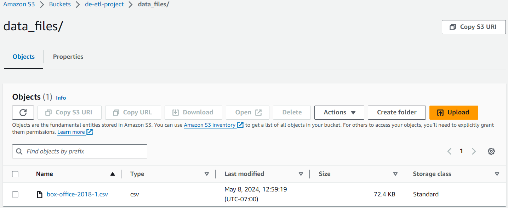
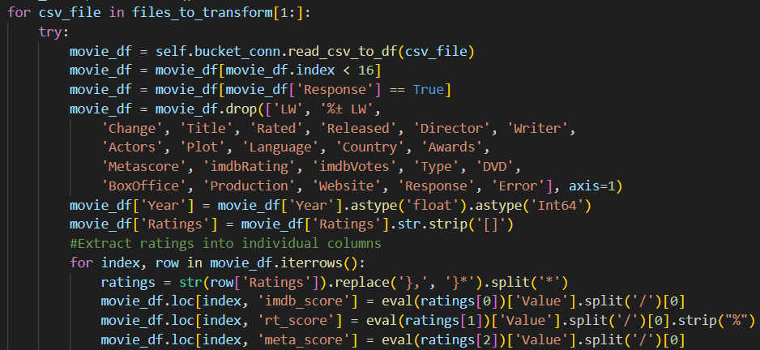
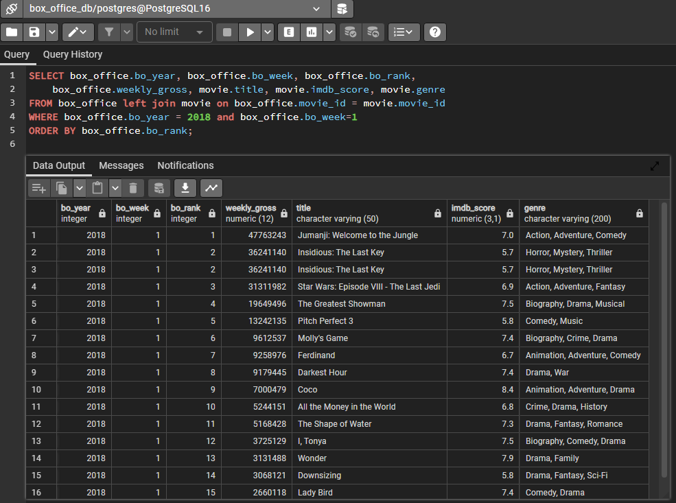

# Box Office Data for Analysis - ETL

<h3 style="text-decoration:underline;">Overview</h3>

Have you ever asked yourself these questions:

<ul>
 <li>Why does a movie get released at a certain time of year?</li>
 <li>What do people mean with the terms "Summer Blockbuster", "Awards Season" and "Dumpuary"?</li>
 <li>Why don't they make them like they used to?</li>
</ul>

The goal of this project is to collect movie data (including release date, weekly ranking, total sales, and genre) and store it as raw data, clean the data to a relevant and reportable format, and load the data inro a data warehouse (PostgreSQL). The source for this data is Box Office Mojo by IMDB ProTM, and will be retrieved utilizing the python library <a href="https://pypi.org/project/boxoffice-api/">BoxOffice-API.</a>

<h3 style="text-decoration:underline;">The ETL Process</h3>
<h4>Extract</h4>

The extraction process receives the target year to be scraped as passed via program arguments (via ArgumentParser). For each week of the year, a call to the Box Office API is made. The resultant dataframe (pandas) is written out an AWS S3 bucket as a comma-separated file.

<h4>Transform</h4>

The transform phase has 2 main goals: 

<ul>
<li>Trimming the box office data in each of the csv files created during the extract phase down to the top 15 ranked films per week</li>
<li>Cleaning that resultant data into a form that can be stored during the load phase.</li>
</ul>

The transform contains common cleaning patterns including: dropping unnecessary entries, changing data types for consistency, and stripping/splitting composite fields into individual dimension. The resultant dataframe is then passed to the load phase for storage.

<h4>Load</h4>

The load phase takes the supplied dataframe, and writes the box office data the the database. PostgreSQL was utilized, the table structure reflects one fact (box office info), and two supporting dimensions (movie and distributor).

